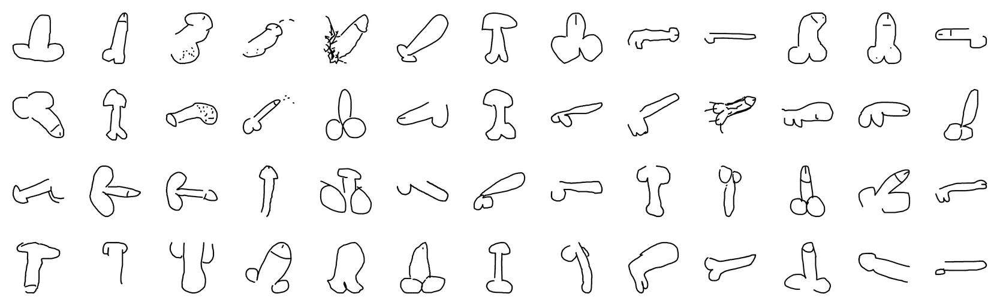

# The 'Do not draw a penis?' Dataset

In 2018 Google open-sourced the [Quickdraw data set](https://github.com/googlecreativelab/quickdraw-dataset). “The world's largest doodling data set”. The set consists of 345 categories and over 15 million drawings. For obvious reasons the data set was missing a few specific categories that people seem to enjoy drawing. This made us at [Moniker](https://studiomoniker.com) think about the moral reality big tech companies are imposing on our global community and that most people willingly accept this. Therefore we decided to publish an appendix to the Google Quickdraw data set.

So far we have collected 10K doodles formatted the same way as Google's dataset. We are happy to announce you can download them here. We have collected these using initially using [Amazon's Mechanical Turk](https://www.mturk.com/), which was drudgingly audited by the staff here at Moniker.

Following the release of the [Do Not Draw a Penis project](https://www.donotdrawapenis.com) we will also update the dataset with user contributed doodles... The Do Not Draw a Penis project functions as an agent to collect inappropriate doodles from people who are not willing to stay within the moral guidelines set by our social network providers.

## Dataset's provided

Similar to Google's QuickDraw dataset, we offer the data in the following forms. More information on how to interpret this data can be found [here](https://github.com/googlecreativelab/quickdraw-dataset#the-raw-moderated-dataset).

- [Raw files](penis-raw) (`.ndjson`)
- [Simplified drawings files](penis-simplified) (`.ndjson`)

## Relevant Locations

- [Google's QuickDraw Dataset](https://github.com/googlecreativelab/quickdraw-dataset)
- [Data Collection - Do Not Draw a Penis project](https://www.donotdrawapenis.com)

## Technologies

Data collection:

- Amazon's Mechanical Turk
- Do not draw

## Credits

Concept & development by Moniker
Luna Maurer & Roel Wouters

### Commissioners

Mozilla, Brett Gaylor HKW, Daniel Neugebauer

### Technical Development

Moniker, Tjerk Woudsma, Thomas Boland, Jae Perris

## License

This data made available by Moniker under the [Creative Commons Attribution 4.0 International license.](https://creativecommons.org/licenses/by/4.0/)
